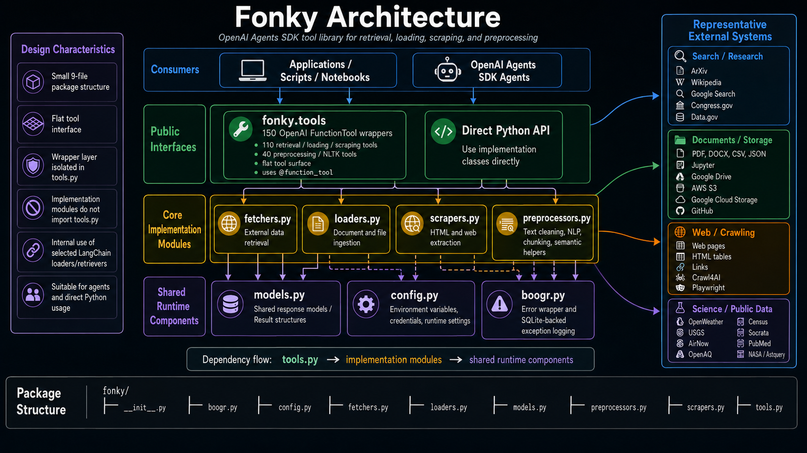

###### Fonky


<p align="left">
  <a href="#purpose">Purpose</a> &nbsp;|&nbsp;
  <a href="#architecture">Architecture</a> &nbsp;|&nbsp;
  <a href="#package-structure">Package Structure</a> &nbsp;|&nbsp;
  <a href="#installation">Installation</a> &nbsp;|&nbsp;
  <a href="#-provider-integrations">Provider Integrations</a> &nbsp;|&nbsp;
  <a href="resources/Tools.md">Tools</a> &nbsp;|&nbsp;
  <a href="resources/User-Guide.md">User Guide</a> &nbsp;|&nbsp;
  <a href="#validation">Validation</a>
</p>

___

[](https://is-leeroy-jenkins.github.io/Fonky/)

## 🎯 Purpose

| Capability                            | Module                  |
|---------------------------------------|-------------------------|
| Data retrieval                        | `fonky.fetchers`        |
| Document ingestion                    | `fonky.loaders`         |
| Web extraction                        | `fonky.scrapers`        |
| Text and NLP processing               | `fonky.processors`      |
| Shared models and response structures | `fonky.models`          |
| Runtime configuration                 | `fonky.config`          |
| Error wrapping and logging            | `fonky.boogr`           |
| OpenAI Agents SDK tools               | `fonky.gpt.tools`       |
| Google ADK tools                      | `fonky.gemini.tools`    |
| xAI Grok tools                        | `fonky.grok.tools`      |
| LangChain tools                       | `fonky.langchain.tools` |

### Tool Surface

| Provider path           | Framework         | Executable wrappers |              Provider declarations |
|-------------------------|-------------------|--------------------:|-----------------------------------:|
| `fonky.gpt.tools`       | OpenAI Agents SDK |                 150 |   Decorated `FunctionTool` objects |
| `fonky.gemini.tools`    | Google ADK        |                 150 |                ADK wraps callables |
| `fonky.grok.tools`      | xAI SDK           |                 150 | 150 explicit `*_tool` declarations |
| `fonky.langchain.tools` | LangChain Core    |                 150 |          Decorated LangChain tools |

## 🛠️ Architecture



## 🔁 Fonky flow

)

## 📦 Package Structure

```text
fonky/
├── __init__.py
├── boogr.py
├── config.py
├── fetchers.py
├── loaders.py
├── models.py
├── processors.py
├── scrapers.py
├── gpt/
│   ├── __init__.py
│   └── tools.py
├── gemini/
│   ├── __init__.py
│   └── tools.py
├── grok/
│   ├── __init__.py
│   └── tools.py
└── langchain/
    ├── __init__.py
    └── tools.py
```

## ⚙️ Installation

```powershell
python -m venv .venv
.\.venv\Scripts\Activate.ps1
python -m pip install --upgrade pip wheel
python -m pip install -r requirements.txt
python -m pip check
```

### Playwright

```powershell
python -m playwright install chromium
```

## 🤖 Provider Integrations

### OpenAI Agents SDK

```python
from agents import Agent, Runner

from fonky.gpt.tools import fetch_arxiv
from fonky.gpt.tools import fetch_wikipedia

agent = Agent(
    name='Research Assistant',
    instructions='Use the supplied Fonky tools when required.',
    tools=[
        fetch_arxiv,
        fetch_wikipedia,
    ] )

result = Runner.run_sync(
    agent,
    'Research retrieval augmented generation.' )

print( result.final_output )
```

### Google ADK

```python
from google.adk.agents import Agent

from fonky.gemini.tools import fetch_arxiv
from fonky.gemini.tools import fetch_wikipedia

agent = Agent(
    name='research_assistant',
    model='gemini-3.7-flash',
    instruction='Use the supplied Fonky tools when required.',
    tools=[
        fetch_arxiv,
        fetch_wikipedia,
    ] )
```

### xAI Grok

```python
from fonky.grok.tools import cse_search_tool
from fonky.grok.tools import fetch_cse_search

tools = [
    cse_search_tool,
]

# Pass ``tools`` to the xAI chat request.
# When Grok requests ``fetch_cse_search``, execute the callable locally:
result = fetch_cse_search(
    keywords='federal appropriations law',
    results=5 )
```

### LangChain

```python
from fonky.langchain.tools import fetch_arxiv
from fonky.langchain.tools import fetch_wikipedia

tools = [
    fetch_arxiv,
    fetch_wikipedia,
]
```

## ✅ Validation

```powershell
python -m compileall .\fonky
python -c "import fonky; import fonky.gpt.tools; import fonky.gemini.tools; import fonky.grok.tools; import fonky.langchain.tools; print('ok')"
```

## 📚 Documentation

- [Tools Reference](resources/Tools.md)
- [User Guide](resources/user-guide.md)
- [MkDocs Site](https://is-leeroy-jenkins.github.io/Fonky/)

## 📝 License


[](LICENSE.txt)
