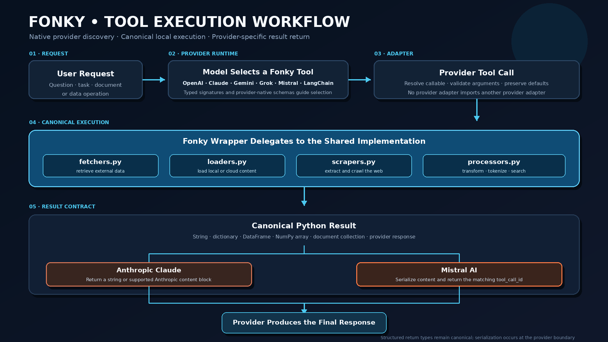

# API Reference

___

## Canonical modules

| Module | Purpose |
|---|---|
| [`fonky.fetchers`](fetchers.md) | Retrieval and external API operations. |
| [`fonky.loaders`](loaders.md) | Document, file, cloud, mail, and structured-data loading. |
| [`fonky.scrapers`](scrapers.md) | Web extraction, rendering, and crawling. |
| [`fonky.processors`](processors.md) | Text, NLP, chunking, vectorization, and semantic-search operations. |
| [`fonky.models`](models.md) | Shared request and response structures. |
| [`fonky.config`](config.md) | Runtime configuration. |
| [`fonky.boogr`](boogr.md) | Error wrapping and logging. |

## Provider tool modules

| Module | Framework |
|---|---|
| [`fonky.gpt.tools`](gpt-tools.md) | OpenAI Agents SDK |
| [`fonky.gemini.tools`](gemini-tools.md) | Google ADK |
| [`fonky.grok.tools`](grok-tools.md) | xAI SDK |
| [`fonky.langchain.tools`](langchain-tools.md) | LangChain Core |
