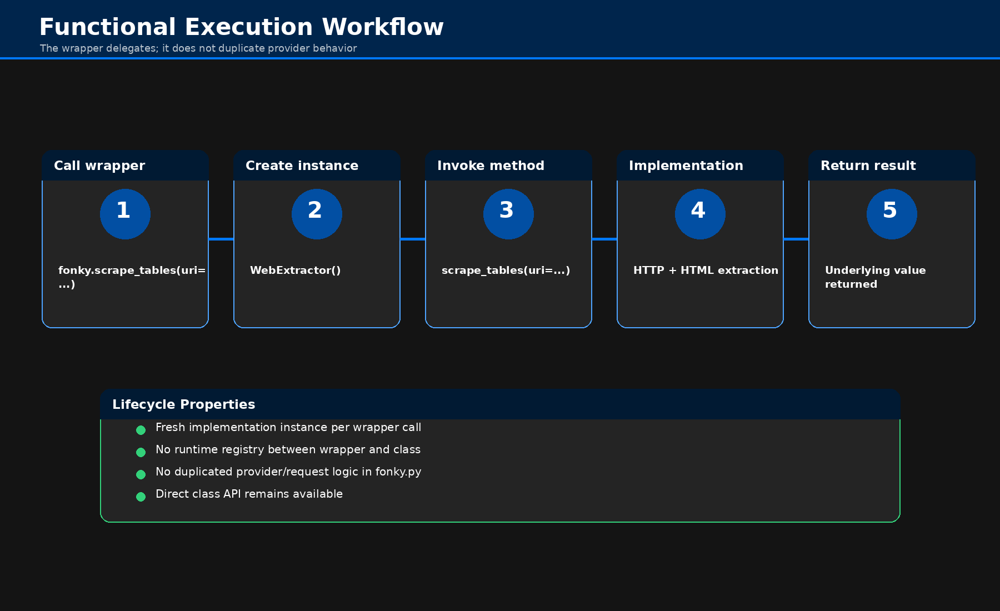

# Architecture

Fonky separates implementation behavior from a consolidated functional API. `fonky.py` delegates; it does not recreate provider behavior.


## Layers

1. **Consumer code** — scripts, notebooks, applications, and future Tool orchestration.
2. **`fonky.py`** — 110 typed module-level functions grouped into 9 domains.
3. **Implementation modules** — `fetchers.py`, `loaders.py`, and `scrapers.py`.
4. **External sources** — APIs, cloud services, local files, and web pages.

## Implementation Inventory

| Module | Classes | Responsibility |
|---|---:|---|
| `fetchers.py` | 49 | Remote APIs, search, public data, environment, maps, astronomy, archives |
| `loaders.py` | 29 | Local files, Office formats, cloud files, repositories, web documents |
| `scrapers.py` | 2 | HTML extraction and page-structure scraping |

## Execution Path



```text
fonky.scrape_tables()
    ↓
WebExtractor()
    ↓
WebExtractor.scrape_tables(uri=...)
    ↓
implementation behavior in scrapers.py
    ↓
result returned to caller
```

## Domain Organization

| Domain | Wrappers |
|---|---:|
| Archives | 11 |
| Astronomical | 10 |
| Cloud | 8 |
| Demographic | 5 |
| Documents | 18 |
| Environmental | 19 |
| Geospatial | 10 |
| Health | 4 |
| Web | 25 |

The domain sections are organizational. There is no runtime registry between a wrapper and its target class.

## Supporting Modules

- `config.py` supplies environment-driven configuration and request/provider descriptions.
- `models.py` defines structured models and existing `ToolDef` infrastructure.
- `processors.py` contains text processing outside the current wrapper scope.
- `core.py` defines the core result model.

## State and Lifecycle

Each wrapper creates a fresh implementation instance. If a workflow intentionally depends on persistent instance state, instantiate the underlying class directly.

## Error Boundary

The wrapper layer returns implementation results directly and does not impose a second error envelope. Several implementation modules use the external `boogr` package for error/logging behavior.

## Intentional Non-Goals

The current design does not add a registry, global provider objects, factories, duplicated validation, or automatic Tool registration.
