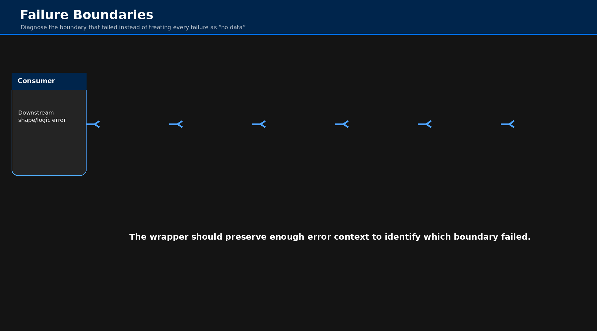
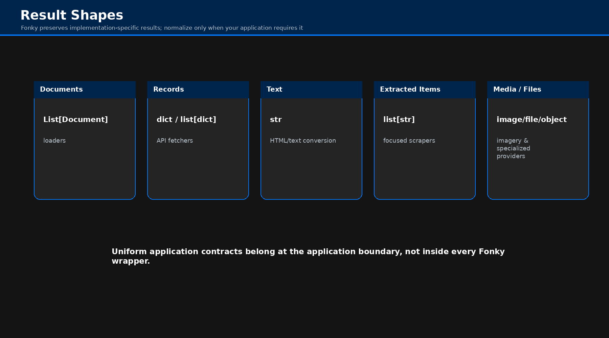
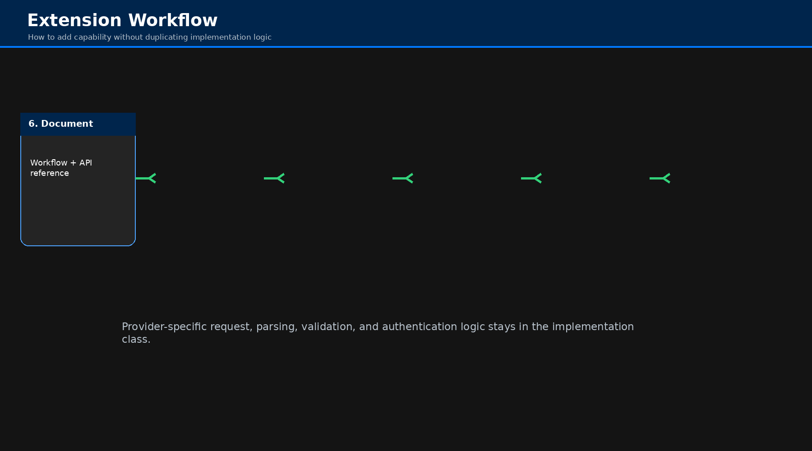

# Architecture

Fonky's architecture is intentionally split between **public call ergonomics** and **provider/format
implementation behavior**.

## Responsibilities

| Layer         | Owns                                                                                     | Does Not Own                                                          |
|---------------|------------------------------------------------------------------------------------------|-----------------------------------------------------------------------|
| `fonky.py`    | Typed public functions, argument exposure, one-shot instance lifecycle                   | Provider protocol details, response parsing, loader internals         |
| `fetchers.py` | HTTP endpoints, provider validation, authentication inputs, API request/response shaping | Application UI or cross-provider orchestration                        |
| `loaders.py`  | Source/file loading, document conversion, format integration, loader state               | General remote API semantics                                          |
| `scrapers.py` | HTML retrieval and structural extraction                                                 | General crawling orchestration beyond its extraction responsibilities |
| `config.py`   | Environment-derived settings and credentials                                             | Provider business logic                                               |

## Functional Calls Versus Retained Instances

A wrapper creates a fresh implementation object and performs one operation. That is ideal for normal
application calls such as `fetch_air_now()`, `load_pdf()`, or `scrape_tables()`.

Use the class directly when a workflow depends on retained state or helper methods. This matters most
for loaders because the base loader stores loaded documents and split configuration.

## Failure Boundaries

A failure can occur before the provider is ever contacted:

1. missing Python dependency;
2. invalid function argument;
3. missing local file;
4. missing credential;
5. network/DNS/timeout failure;
6. HTTP/provider error;
7. parser/response-shape failure;
8. downstream result handling failure.

The wrapper layer should not hide which boundary failed.

## Result Contracts

Fonky preserves provider/loader-specific results. Common families are `Document` collections,
dictionaries, lists of records, strings, extracted string lists, images/files, and provider-shaped
objects.

## Extension Boundary

New provider behavior belongs in the implementation class first. A `fonky.py` wrapper is added only
after that behavior has a clear public one-shot use case.
