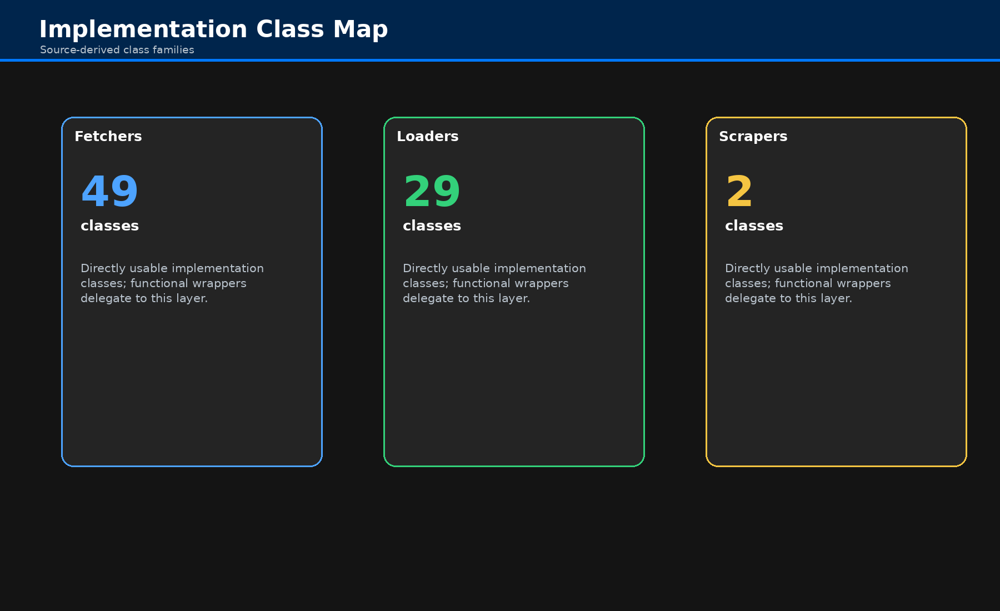
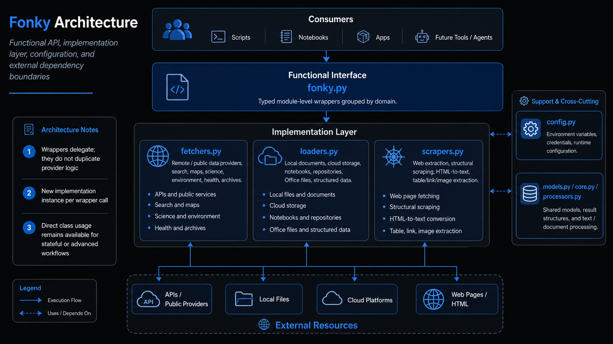

# Architecture


## Runtime Shape

```text
Applications / notebooks / agents
           |
           +--> fonky.py   (public `@tool` exports)
           |
           +--> tools.py   (domain grouping / discovery)
                                                   --> fetchers.py
                          --> loaders.py
                          --> scrapers.py
                               |
                               +--> models.py / processors.py / core.py / config.py
```

## Module Responsibilities

| Module | Responsibility | Notes |
|---|---|---|
| `fonky.py` | public execution surface | literal decorators; one export per public operation |
| `tools.py` | discovery surface | returns domain names, tool lists, and tool names |
| `fetchers.py` | remote/service retrieval | APIs, public sources, search, weather, maps, health, archives |
| `loaders.py` | ingestion and conversion | files, cloud, notebooks, recursive web loading, document creation |
| `scrapers.py` | targeted extraction | readable text and page structures |
| `models.py` | data schemas and tool helpers | document/tool related types |
| `processors.py` | transformation support | normalization and parser helpers |
| `core.py` | shared utility base | common errors and supporting runtime pieces |
| `config.py` | environment-backed settings | provider/runtime configuration |

## Public-API Consequence

Literal decoration means exported names in `fonky.py` are not plain Python functions; they are LangChain tool objects.

```python
from fonky.fonky import fetch_google_search

result = fetch_google_search.invoke(
    {
        'question': 'appropriations law guidance',
        'max_documents': 5,
        'full_documents': False,
        'include_metadata': True
    }
)
```

## Supporting Views




