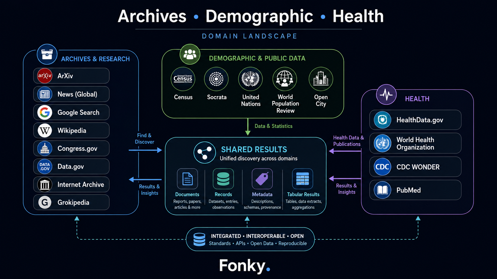

# Archives & Research

## Scope

Archive and research workflows concentrate public knowledge sources, scholarly repositories, open-government catalogs, and reusable loaders for research corpora.

## Key Operations

| Operation | Primary Use |
|---|---|
| `fetch_arxiv` | query academic literature and return records or full documents |
| `fetch_google_search` | web search discovery for public-source retrieval |
| `fetch_gov_data` | Data.gov catalog retrieval |
| `fetch_congress` | Congress.gov legislative and policy material |
| `fetch_news` | current-news discovery through configured provider |
| `load_arxiv` | materialize ArXiv content as documents |
| `load_wikipedia` | materialize Wikipedia content as documents |

## Workflow Patterns

- discovery → fetch candidate sources
- materialization → convert selected sources into documents
- downstream → summarize, embed, index, or compare across sources

## Notes

Prefer archive tools for discovery and provenance-rich retrieval. Prefer loaders when the downstream step requires LangChain `Document` objects.
