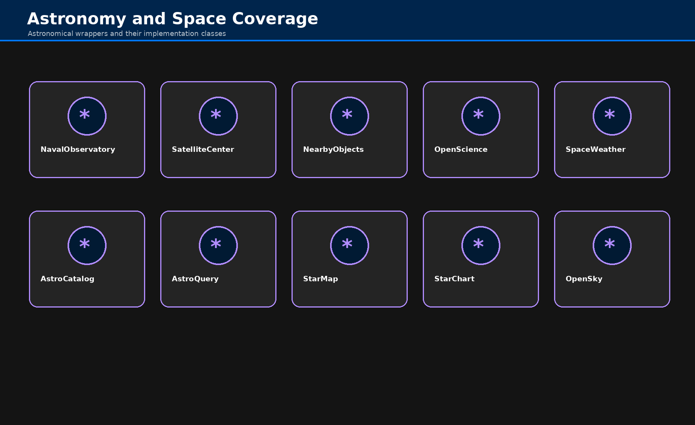

# Astronomical, Space & Flight

## Scope

Astronomical workflows combine observatory, catalog, orbit, space-weather, and flight-state sources into shared monitoring and discovery patterns.

## Key Operations

| Operation                 | Primary Use                                 |
|---------------------------|---------------------------------------------|
| `fetch_naval_observatory` | observatory and ephemeris-related retrieval |
| `fetch_satellite_center`  | satellite/space-object support retrieval    |
| `fetch_nearby_objects`    | small-body and near-Earth object data       |
| `fetch_open_science`      | open science and astronomical data          |
| `fetch_space_weather`     | space-weather and solar-activity retrieval  |
| `fetch_astro_catalog`     | catalog and astronomical source retrieval   |
| `fetch_astro_query`       | query-oriented astronomy access             |
| `fetch_open_sky`          | OpenSky flight-state retrieval              |

## Workflow Patterns

- monitor celestial or aircraft state
- combine live and historical data
- enrich with catalog or geospatial context
- render alerts, tracking views, or situational awareness

## Notes

Use this domain when the data is fundamentally observational, orbital, or flight-oriented rather than generic geospatial mapping.
