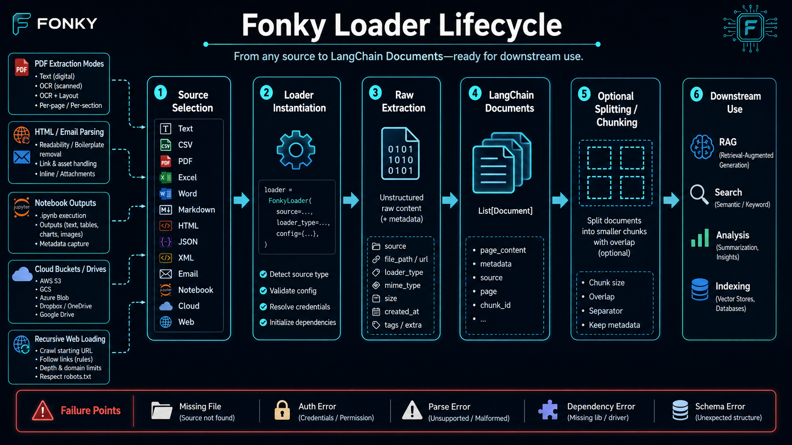

# Document Loading

## Scope

Document loading turns local, remote, and generated sources into normalized content structures suitable for downstream chunking, indexing, and analysis.

## Key Operations

| Operation | Primary Use |
|---|---|
| `load_text` | plain-text ingestion |
| `load_csv` | tabular CSV ingestion |
| `read_pdf / load_pdf` | PDF parsing and document construction |
| `load_excel` | spreadsheet ingestion |
| `load_word` | DOCX ingestion |
| `load_markdown` | Markdown ingestion |
| `load_json / load_xml` | structured text ingestion |
| `load_jupyter_notebook` | notebook source and output ingestion |
| `load_powerpoint / load_powerpoint_multiple` | slide content ingestion |
| `load_email / load_outlook` | email and mailbox-related loading |

## Workflow Patterns

- select source
- instantiate loader
- extract raw text/content
- normalize into LangChain `Document` objects
- optionally split or index downstream

## Notes

Use document loaders when downstream systems expect `Document` objects with `page_content` and `metadata`.
