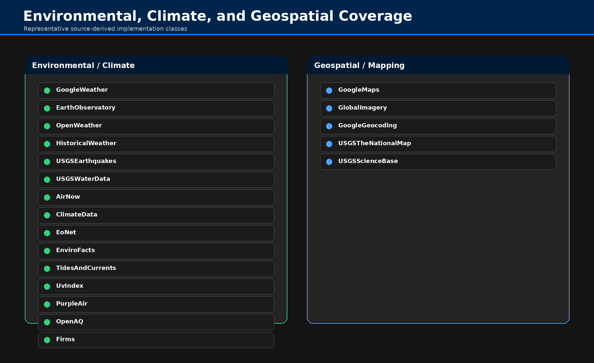

# Geospatial & Mapping

## Scope

Geospatial workflows provide geocoding, reverse geocoding, address validation, directions, imagery, and map-service retrieval.

## Key Operations

| Operation                                          | Primary Use                               |
|----------------------------------------------------|-------------------------------------------|
| `geocode_location`                                 | resolve a place/address to coordinates    |
| `geocode_coordinates`                              | reverse-geocode coordinates               |
| `validate_address`                                 | validate and normalize an address         |
| `request_directions`                               | retrieve routing and navigation output    |
| `fetch_global_imagery_wms_map`                     | retrieve WMS imagery                      |
| `fetch_global_imagery_map_services`                | discover or use imagery service endpoints |
| `fetch_google_geocoding`                           | provider-backed geocoding                 |
| `fetch_usgs_national_map / fetch_usgs_sciencebase` | USGS geospatial retrieval                 |

## Workflow Patterns

- resolve location
- add imagery or map service context
- combine with environmental or demographic records
- visualize or route downstream

## Notes

Use geospatial tools when the problem centers on location resolution, routing, or imagery rather than generic web retrieval.
