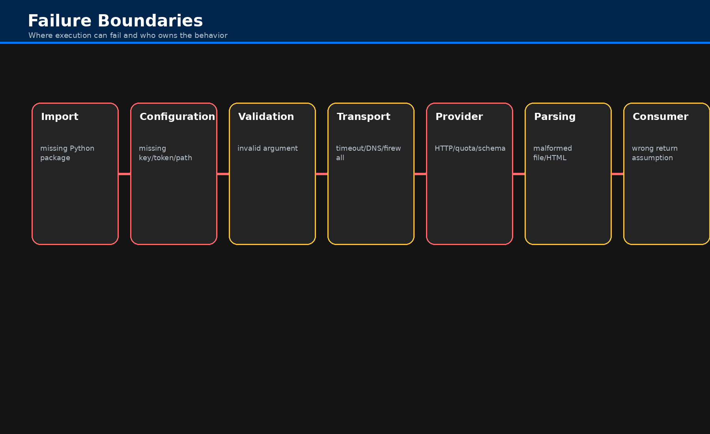

# Troubleshooting

Troubleshooting Fonky usually means identifying which boundary failed: import, configuration,
validation, local filesystem, network transport, provider response, parsing, or return handling.

## Failure Boundaries



## Common Symptoms

| Symptom | Likely cause |
| --- | --- |
| `ModuleNotFoundError` | Missing package or local module. Install dependencies or fix import path. |
| Credential or authorization error | Missing/invalid environment variable, token file, API key, service account, or provider permission. |
| `FileNotFoundError` | Path is wrong relative to current working directory or file does not exist. |
| Timeout / connection error | Network, proxy, firewall, provider outage, or timeout setting. |
| HTTP 4xx/5xx | Provider rejected request or provider failed. Inspect status code and payload. |
| Empty result | Valid call with no provider matches, filtered response, or parsed page without target elements. |
| Unexpected return type | Provider-specific result shape; consult target implementation API. |

## Import Fails Before Any Call Runs

This usually means the active environment lacks a dependency imported by an implementation module.
Install requirements and retry a minimal import.

```powershell
python -m pip install -r requirements.txt
python -c "from fonky import fonky; print('ok')"
```

## Credential Failures

Provider wrappers forward arguments to the implementation class. Some implementations use
credentials from `config.py`; others accept credentials as method arguments. Verify both the API page
and `configuration.md` before assuming the wrapper is at fault.

## Filesystem Failures

Local loaders generally validate that a path exists before loading. Check current working directory,
absolute path, file extension, and file permissions.

## Network Failures

Network and provider calls can fail for DNS, proxy, TLS, timeout, firewall, rate-limit, quota, or
provider status reasons. Test with the smallest possible provider query before running a batch.

## Parsing Failures

Document parsing depends on format-specific libraries. A valid file path can still fail if the file
is corrupted, encrypted, malformed, image-only, or unsupported by the selected loader mode.

## Wrapper Routing Failures

A wrapper routing bug would appear as a Python error before the implementation method starts, such as
an undefined class name, missing method, or invalid keyword. The generated wrapper layer should be
covered by a routing test that validates every wrapper resolves to its declared class and method.
