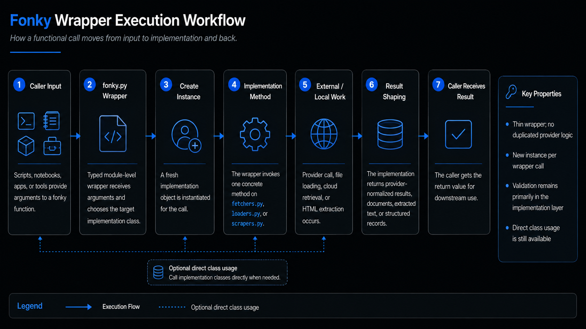

# Web Retrieval & Scraping

### Scope

Web workflows split into three tracks: fetching pages, loading pages into documents, and scraping structured page elements.

### Key Operations

| Operation                                                             | Primary Use                           |
|-----------------------------------------------------------------------|---------------------------------------|
| `fetch_web_page`                                                      | retrieve page content directly        |
| `render_web_page`                                                     | render page content for dynamic cases |
| `load_web / load_web_recursive / load_web_pages`                      | load web sources into documents       |
| `crawl_web / scrape_crawler_page`                                     | crawl-oriented retrieval support      |
| `scrape_web_page`                                                     | generic page scrape                   |
| `extract_web_title / extract_web_links / extract_web_structured_data` | focused extraction utilities          |
| `scrape_paragraphs / scrape_lists / scrape_tables / scrape_images`    | structure-specific extraction         |

### Workflow Patterns

- fetch raw page
- load page to documents if downstream chunking or indexing is required
- scrape structure if the goal is headings, links, tables, or images
- use recursive loading for site sections rather than individual pages

### Notes

Choose **loaders** when the result must become document objects. Choose **scrapers** when you need HTML structures. Choose **fetchers** when you need raw or rendered page retrieval.
