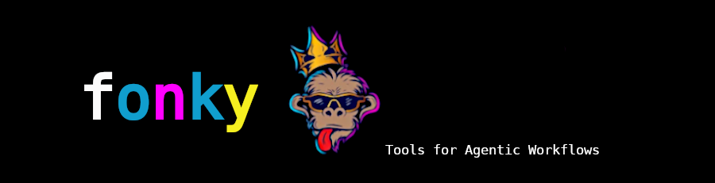

Fonky is a Python framework for document loading, API fetching, web extraction, text processing,
structured tool generation, and MkDocs-based API documentation.

It provides a common pattern for working with files, web sources, public APIs, cloud sources, and
AI-callable tools:

```text
Load or fetch source content
    -> Normalize the result
    -> Process or split the content
    -> Expose functionality as callable tools
    -> Document the source with MkDocs and mkdocstrings
```

## Project Purpose

Fonky is designed to make heterogeneous information sources easier to use from Python applications,
notebooks, retrieval workflows, and AI tool-calling systems.

The project supports these core use cases:

| Use case          | Description                                                                                                                     |
| ----------------- | ------------------------------------------------------------------------------------------------------------------------------- |
| Document loading  | Load local, web, office, PDF, notebook, cloud, and repository content into document objects.                                    |
| API fetching      | Retrieve structured data from government, scientific, environmental, health, demographic, geospatial, and public-data services. |
| Web extraction    | Extract text, links, metadata, headings, images, and tables from web content.                                                   |
| Text processing   | Clean, normalize, tokenize, chunk, vectorize, and prepare text for downstream workflows.                                        |
| AI tooling        | Convert Python functions and class methods into structured tool definitions for model tool-calling.                             |
| Error logging     | Wrap handled exceptions and write failure metadata to a SQLite database.                                                        |
| API documentation | Render Google-style Python docstrings into a navigable MkDocs site.                                                             |

## Core Modules

Fonky is organized as a flat Python module project.

| Module             | Responsibility                                                                                                  |
| ------------------ | --------------------------------------------------------------------------------------------------------------- |
| `config.py`        | Environment variables, API keys, path constants, logging paths, and configuration helpers.                      |
| `boogr.py`         | Project exception wrapper and SQLite-backed exception logger.                                                   |
| `core.py`          | Shared base classes and core project abstractions.                                                              |
| `loaders.py`       | Document loaders for local files, web content, cloud sources, office files, and external document repositories. |
| `fetchers.py`      | API clients and public-data fetchers.                                                                           |
| `scrapers.py`      | Web scraping and HTML extraction utilities.                                                                     |
| `processors.py`    | Text cleaning, tokenization, chunking, NLP, and vectorization helpers.                                          |
| `models.py`        | Structured models and AI tool definitions.                                                                      |
| `archives.py`      | Archive and knowledge-source access helpers.                                                                    |
| `documents.py`     | Document-loader export module.                                                                                  |
| `web.py`           | Web-extraction export module.                                                                                   |
| `cloud.py`         | Cloud-loader export module.                                                                                     |
| `astronomical.py`  | Astronomy and space-data export module.                                                                         |
| `demographic.py`   | Demographic-data export module.                                                                                 |
| `environmental.py` | Environmental-data export module.                                                                               |
| `geospatial.py`    | Geospatial-data export module.                                                                                  |
| `health.py`        | Health-data export module.                                                                                      |

## Documentation Sections

Use the documentation sections below to move from setup to usage, development, and deployment.

<div class="grid cards" markdown>

* **Getting Started**

  Set up the virtual environment, install dependencies, validate imports, load a first document, and
  build the documentation site.

  [Open Getting Started](getting-started.md)

* **Configuration**

  Review environment variables, logging paths, API keys, provider settings, and MkDocs configuration
  requirements.

  [Open Configuration](configuration.md)

* **Architecture**

  Understand how loaders, fetchers, scrapers, processors, models, logging, configuration, and
  documentation fit together.

  [Open Architecture](architecture.md)

*
* **Usage**

  Learn practical Fonky examples, including AI tooling with `ToolDef`, schema export, and
  provider-neutral tool dispatch.

  [Open Usage](usage.md)

* **User Guide**

  Work through longer end-to-end workflows across document loading, processing, web extraction,
  fetching, and tool orchestration.

  [Open User Guide](user-guide.md)


</div>

## API Reference

The API reference is generated from Python source docstrings through mkdocstrings.

API pages are located under:

```text
docs/api/
```

Only API pages should contain live mkdocstrings directives such as:

```markdown
::: loaders
```

Manual documentation pages should describe directives as examples only and should not contain live
directives.

Primary API sections:

| API page                              | Module             |
| ------------------------------------- | ------------------ |
| [Boogr](api/boogr.md)                 | `boogr.py`         |
| [Core](api/core.md)                   | `core.py`          |
| [Fetchers](api/fetchers.md)           | `fetchers.py`      |
| [Loaders](api/loaders.md)             | `loaders.py`       |
| [Models](api/models.md)               | `models.py`        |
| [Processors](api/processors.md)       | `processors.py`    |
| [Scrapers](api/scrapers.md)           | `scrapers.py`      |

## Standard Workflow

The expected local workflow is:

```text
Create and activate a virtual environment
    -> Install requirements
    -> Compile Python source
    -> Validate imports
    -> Build MkDocs
    -> Serve documentation locally
    -> Deploy to GitHub Pages when clean
```

Basic validation commands:

```powershell
python -m compileall .
Select-String -Path .\docs\*.md -Pattern "^:::\s+[A-Za-z_]"
Select-String -Path .\docs\api\*.md -Pattern "^:::\s+[A-Za-z_]"
mkdocs build
```

Expected directive behavior:

```text
docs/*.md          -> no live mkdocstrings directives
docs/api/*.md      -> live mkdocstrings directives are required
```

## AI Tooling Overview

Fonky's AI tooling layer is centered on `ToolDef` in `models.py`.

A normal Python function or object method can be wrapped as a structured tool:

```python
from models import ToolDef


def count_words(text: str) -> int:
    return len(text.split())


tool = ToolDef.from_callable(
    function=count_words,
    name="count_words",
    description="Count words in a text value.",
    category="text"
)

schema = tool.to_openai()
result = tool.call(
    {
        "text": "Fonky exposes Python functions as AI-callable tools."
    }
)

print(schema)
print(result)
```

This allows existing Fonky loaders, fetchers, scrapers, and processors to be exposed to model
tool-calling systems without rewriting the underlying implementation.

## Logging Overview

Handled exceptions use the explicit project logging pattern:

```python
except Exception as e:
    exception = Error(e)
    exception.module = "loaders"
    exception.cause = "TextLoader"
    exception.method = "load(self, path: str, encoding: Optional[str]=None) -> List[Document]"
    Logger().write(exception)
    raise exception
```

The logger writes exception metadata to:

```text
logging/Exceptions.db
```

with the default table:

```text
Exceptions
```

The logging system is designed to preserve traceability while still raising failures to the caller.

## Build Requirement

Before publishing documentation, the local build should pass:

```powershell
mkdocs build
```

A clean documentation state means:

```text
- Python source compiles.
- API pages contain the only live mkdocstrings directives.
- Manual pages do not accidentally render source modules.
- Google-style docstrings render without Griffe warnings.
- Markdown examples do not trigger autorefs warnings.
- The site renders locally with mkdocs serve.
```
