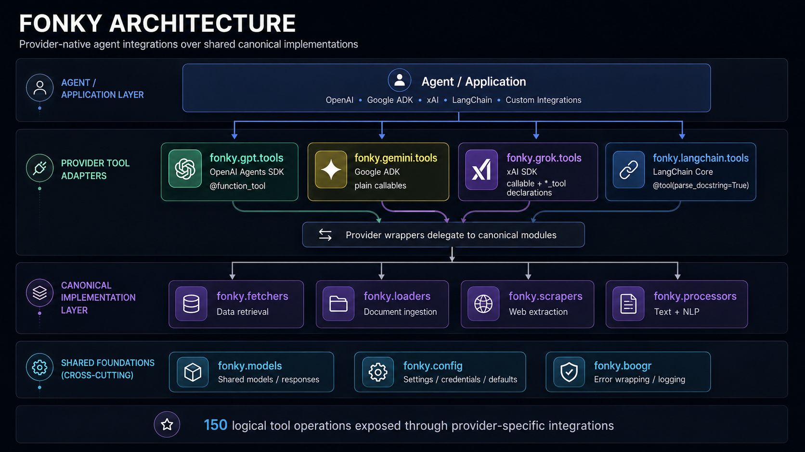

___

Fonky is a Python library that exposes retrieval, loading, scraping, document-processing, and
text-processing functionality to AI agents through provider-specific tool integrations.

## Purpose

Fonky separates canonical implementations from agent-framework integration. Retrieval, loading,
scraping, and processing logic remains in shared modules while provider packages expose those
operations through the conventions required by OpenAI Agents SDK, Anthropic Claude, Google ADK,
xAI, Mistral AI, and LangChain.

## Core capabilities

| Area | Module | Purpose |
|---|---|---|
| Retrieval | `fonky.fetchers` | Retrieve data from APIs, search services, public data sources, geospatial services, environmental services, and web sources. |
| Loading | `fonky.loaders` | Load documents, files, cloud objects, mail, notebooks, and structured data. |
| Web extraction | `fonky.scrapers` | Extract structured and unstructured content from web pages and crawled sources. |
| Processing | `fonky.processors` | Normalize, clean, tokenize, transform, chunk, vectorize, and search text and datasets. |
| Models | `fonky.models` | Shared models and response structures used by canonical implementations. |
| Configuration | `fonky.config` | Runtime configuration, credentials, and defaults. |
| Error handling | `fonky.boogr` | Shared error wrapping and logging. |

## Provider integrations

| Package | Framework | Tool exposure |
|---|---|---|
| `fonky.gpt.tools` | OpenAI Agents SDK | `@function_tool` |
| `fonky.claude.tools` | Anthropic Claude SDK | `@beta_tool` |
| `fonky.gemini.tools` | Google ADK | Plain Python callables wrapped by ADK |
| `fonky.grok.tools` | xAI SDK | Executable callables plus explicit `*_tool` declarations |
| `fonky.mistral.tools` | Mistral AI SDK | Executable callables plus JSON `*_tool` declarations |
| `fonky.langchain.tools` | LangChain Core | `@tool(parse_docstring=True)` |

Each provider package exposes the same logical Fonky operations while preserving the provider-specific
tool contract. Every provider integration is a peer adapter that delegates directly to the canonical
to the canonical Fonky implementation modules rather than depending on another provider package.

## Documentation layout

1. **Architecture** defines canonical modules, provider adapters, naming rules, and execution flow.
2. **User Guide** provides task-oriented examples for selecting and using Fonky tools.
3. **API Reference** renders source documentation with MkDocs and mkdocstrings.
4. **Development** defines validation, documentation, and extension requirements.

## Build the documentation

```powershell
python -m pip install -r requirements.txt
python -m pip install mkdocs-material mkdocstrings[python]
mkdocs serve
```

Build the static site:

```powershell
mkdocs build
```
