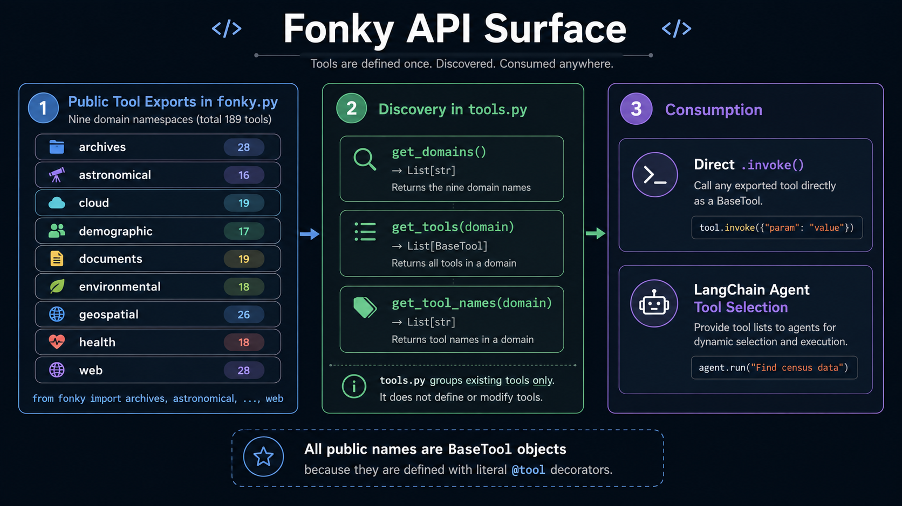

___

Fonky is a reusable Python integration framework for **retrieval, document ingestion, web extraction,
cloud loading, public-data access, environmental/geospatial analysis, astronomy, demographics, and
health-data workflows**.

The framework deliberately provides two levels of control:

- **`fonky.py`** — a flat functional API with **110 operations across nine domains**.
- **implementation classes** — the provider and format-specific classes in `fetchers.py`, `loaders.py`, and `scrapers.py`.

The functional API is for concise application code. The class API remains available when a workflow
needs retained state, provider-specific helpers, or lower-level control.

## Choose an Area

| Area                      | Use When                                                                                                             |
|---------------------------|----------------------------------------------------------------------------------------------------------------------|
| Archives & Research       | You need papers, web/search results, legislative data, government datasets, news, or archived material.              |
| Astronomy & Space         | You need celestial, satellite, near-Earth-object, space-weather, catalog, star-map, or aviation data.                |
| Cloud & Remote Storage    | You need Google Drive, GCS, AWS S3, OneDrive, or Google Speech-to-Text ingestion.                                    |
| Demographic & Public Data | You need Census, Socrata, UN, world-population, or municipal open-data workflows.                                    |
| Documents                 | You need to load PDF, Word, Excel, CSV, XML, JSON, Markdown, HTML, PowerPoint, email, Outlook, SPFx, or notebooks.   |
| Environmental & Climate   | You need weather, air quality, climate, natural hazards, fires, water, tides, UV, or environmental records.          |
| Geospatial & Mapping      | You need geocoding, reverse geocoding, address validation, directions, imagery, ScienceBase, or National Map data.   |
| Health                    | You need HealthData, WHO/global-health, CDC WONDER, or PubMed retrieval.                                             |
| Web Retrieval & Scraping  | You need page retrieval, crawling, structured extraction, web loading, links, tables, articles, headings, or images. |

## Typical Workflow



```python
from fonky import fonky

papers = fonky.fetch_arxiv(
    question='retrieval augmented generation',
    max_documents=5,
    full_documents=False,
    include_metadata=True
)

for paper in papers:
    print(paper.metadata.get('title'))
    print(paper.page_content[:300])
```

The same functional surface can load local documents, call government/scientific providers, geocode
locations, retrieve environmental observations, or extract structured content from web pages.

## Documentation Paths

- [Getting Started](getting-started.md) — install, configure, verify, and make first calls.
- [User Guide](user-guide.md) — choose a capability and follow a task-oriented workflow.
- [Architecture](architecture.md) — understand state, validation, dependencies, return shapes, and failure boundaries.
- [Configuration](configuration.md) — configure actual provider credentials and runtime settings.
- [Troubleshooting](troubleshooting.md) — diagnose dependency, credential, provider, parser, and filesystem failures.
- [Functional API](api/fonky.md) — exhaustive wrapper reference.
- [Development](development/index.md) — extend fetchers, loaders, scrapers, wrappers, tests, and docs.
