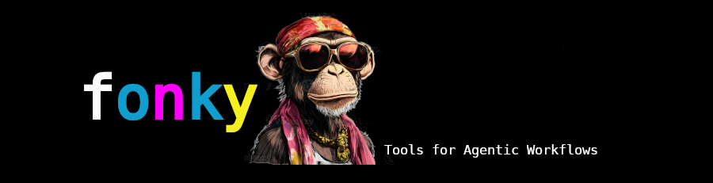
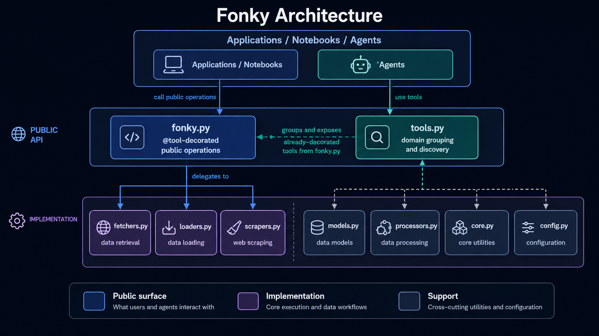

# Fonky



**Fonky** is a Python framework for retrieving, loading, and extracting structured information from public APIs, cloud services, local documents, and web content. The project separates implementation classes from a consolidated functional calling surface so applications can choose either level of control without duplicating provider logic.

The current functional interface in `fonky.py` exposes **110 module-level functions across 9 domains**. Those functions delegate to implementations in `fetchers.py`, `loaders.py`, and `scrapers.py`.

## Design at a Glance



```text
consumer code
    ↓
fonky.py wrapper
    ↓
fresh implementation instance
    ↓
fetchers.py / loaders.py / scrapers.py
    ↓
provider, file, cloud service, or web page
    ↓
returned Python result
```

The wrapper layer does not recreate request construction, authentication, parsing, data shaping, document loading, or scraping behavior. Those responsibilities remain in the implementation classes.

## Domain Coverage


| Domain | Functional Operations | Representative Capabilities |
|---|---:|---|
| Archives | 11 | ArXiv, Drive search, Wikipedia, news, Google Search, government data, Congress, Internet Archive, Grokipedia |
| Astronomical | 10 | Naval Observatory, satellites, nearby objects, Open Science, space weather, catalogs and charts |
| Cloud | 8 | Google Drive, OneDrive, Google Cloud, AWS S3, Speech-to-Text |
| Demographic | 5 | Census, Socrata, United Nations, world population, open-city data |
| Documents | 18 | Text, CSV, PDF, Word, Excel, Markdown, HTML, JSON, XML, email, Outlook, PowerPoint, Jupyter |
| Environmental | 19 | Weather, climate, air quality, earthquakes, water, tides, UV, fires, natural events |
| Geospatial | 10 | Geocoding, reverse geocoding, address validation, directions, imagery, ScienceBase, National Map |
| Health | 4 | HealthData, global health data, CDC WONDER, PubMed |
| Web | 25 | Fetching, crawling, HTML conversion, structured extraction, web loading, scraping, image encoding |

## Functional Interface

```python
from fonky import fonky

documents = fonky.load_pdf(
    path='sample.pdf',
    mode='single',
    extract='plain',
    include=False,
    format='markdown-img',
    size=1000,
    overlap=150,
    has_tables=True
)
```

## Direct Class Interface

```python
from fonky.loaders import PdfLoader

loader = PdfLoader( )
documents = loader.load(
    path='sample.pdf',
    mode='single',
    extract='plain',
    include=False,
    format='markdown-img',
    size=1000,
    overlap=150,
    has_tables=True
)
```

## Documentation Map

| Guide | Purpose |
|---|---|
| [Getting Started](getting-started.md) | Installation, setup, first calls, and verification |
| [Configuration](configuration.md) | Source-derived environment variable and runtime configuration reference |
| [Architecture](architecture.md) | Wrapper boundaries, execution paths, state, and supporting modules |
| [Usage](usage.md) | Practical examples across all domains |
| [User Guide](user-guide.md) | Operational guidance and interface selection |
| [Functional API](api/fonky.md) | Exhaustive reference for all 110 wrappers |
| [Fetchers](api/fetchers.md) | Complete fetcher class/method inventory |
| [Loaders](api/loaders.md) | Complete loader class/method inventory |
| [Scrapers](api/scrapers.md) | Complete scraper class/method inventory |
| [Models](api/models.md) | Structured models and ToolDef infrastructure |
| [Processors](api/processors.md) | Processing and parser classes |
| [Core](api/core.md) | Core result model |

!!! note "Source of truth"
    These pages are generated from the current Fonky source files. The implementation modules remain authoritative when behavior and documentation diverge.
